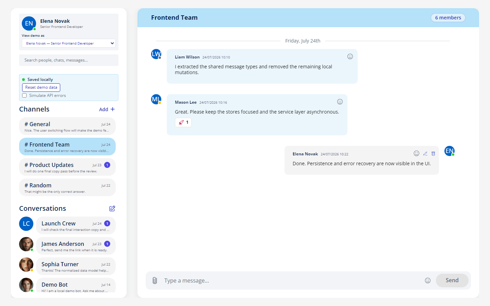
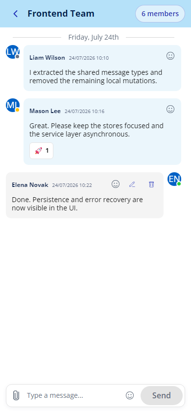

# Message Hub

Message Hub is a frontend-only corporate messenger demo built as a portfolio project. It focuses on a responsive chat experience, reusable Vue components, and client-side state management without requiring a backend.

The application uses seeded demo data and a local mock bot, so it can be explored immediately after startup without API credentials or external services.

**[Live demo](https://message-hub-psi.vercel.app/)** · **[GitHub repository](https://github.com/vitali-lavau/message-hub)**

## Screenshots

### Desktop



### Mobile



## Portfolio documentation

-   [Full project case study in Russian](./docs/PROJECT_CASE_STUDY_RU.md)
-   [Copy-ready resume content in Russian and English](./docs/RESUME_MATERIALS_RU_EN.md)
-   [Stage 8: code quality and automated tests](./docs/QUALITY_STAGE_8_RU.md)

## Current features

-   Ten switchable employee profiles with avatars or initials, presence, roles, and bios
-   User-specific channels, direct conversations, private groups, unread counts, and message ownership
-   General, Frontend Team, Product Updates, and Random channels
-   A private Launch Crew group and seeded direct-message histories
-   Unified search across people, conversations, channels, and message text, with navigation to a matched message
-   Asynchronous mock API with 200–500 ms simulated latency
-   Automatic browser persistence through `localStorage`
-   Demo-data reset and retry controls
-   Development-only API error simulation
-   Sending and editing owned messages, plus deletion through a confirmation dialog
-   Automatic scroll to new messages, sending feedback, edited markers, and date grouping
-   Emoji input and add/remove message reactions with per-user selected state
-   Local file selection, validation, drag-and-drop, image previews, and document metadata
-   Channel creation with member selection and member management for existing groups
-   Last-message previews and timestamps in the sidebar, with unread reset on open
-   Skeleton loading, contextual empty states, auto-dismiss toast notifications, and retry feedback
-   2,000-character message validation and safe wrapping for long content
-   Virtualized message rendering
-   Deterministic mock-bot responses with a visible typing indicator
-   Responsive desktop, tablet, and mobile layouts
-   Tablet drawer navigation and a mobile list-to-chat flow with focus restoration
-   Semantic conversation buttons, accessible icon labels, and keyboard-visible focus
-   Reduced-motion support and improved text contrast
-   Strict TypeScript, ESLint flat config, and reproducible Prettier formatting
-   Unit tests for Pinia stores and asynchronous mock services
-   Component tests for critical interactive and accessible UI elements
-   Seven Playwright browser scenarios covering the main demo lifecycle and mobile overflow

## Tech stack

-   [Nuxt 3](https://nuxt.com/)
-   [Vue 3](https://vuejs.org/)
-   [TypeScript](https://www.typescriptlang.org/)
-   [Pinia](https://pinia.vuejs.org/)
-   SCSS and Tailwind CSS
-   [Tiptap](https://tiptap.dev/)
-   [Headless UI](https://headlessui.com/)
-   [vue-virtual-scroller](https://github.com/Akryum/vue-virtual-scroller)
-   [date-fns](https://date-fns.org/)
-   ESLint and Prettier
-   Vitest, Vue Test Utils, and Nuxt Test Utils
-   Playwright

## Architecture

```text
Vue components
      |
      v
Pinia stores (single source of truth)
      |
      v
Async mock API
      |
      v
localStorage or seeded demo data
```

The client state uses normalized `User`, `Conversation`, and `Message` entities. Components render store data and dispatch store actions instead of mutating props or seed arrays.

Pinia is split by responsibility:

-   `useSessionStore` stores the active demo-user ID.
-   `useUsersStore` provides profiles and presence data.
-   `useConversationsStore` controls membership, selection, private groups, channels, and per-user unread metadata.
-   `useMessagesStore` manages message history, ownership, sending, editing, deleting, reactions, and mock-bot replies.
-   `useUiStore` owns search, modal, mobile-sidebar, request, and notification state.

The mock API loads a persisted snapshot or initializes one from seed data on the first visit. Runtime changes stay in Pinia and are saved asynchronously with a short debounce. This keeps one source of truth while exercising skeleton loading, sending, success, empty, error, retry, and toast-feedback states.

## Getting started

Requirements:

-   Node.js 20 or newer
-   npm

Install dependencies:

```bash
npm install
```

Start the development server:

```bash
npm run dev
```

Open [http://localhost:3000](http://localhost:3000).

No environment variables or API keys are required.

## Available scripts

```bash
npm run dev              # Start the development server
npm run build            # Create a production build
npm run generate         # Generate a static build
npm run preview          # Preview the production build
npm run format:check     # Verify formatting without changing files
npm run lint             # Run ESLint
npm run typecheck        # Run strict Nuxt/Vue TypeScript checking
npm run test:unit        # Test Pinia stores and mock services
npm run test:components  # Test critical Vue components
npm run test:e2e         # Run Playwright in Chromium
npm run quality          # Run every check, test, and production build
```

Install the Playwright browser once before the first E2E run:

```bash
npx playwright install chromium
```

## Automated quality checks

The test suite is split by responsibility:

-   15 unit tests verify conversation membership, unread state, user switching, message
    ownership, reactions, asynchronous sending, mock-bot replies, persistence, request errors,
    and demo reset.
-   4 component tests verify channel selection, accessible unread state, reaction behavior, and
    avatar fallbacks.
-   7 Playwright scenarios verify direct-message sending, channel creation, mock-user switching,
    persistence after reload, restoring the seed through **Reset demo data**, first-visit
    onboarding, and the 320 px mobile layout.

The TypeScript configuration enables `strict` and `noUncheckedIndexedAccess`. Nuxt build-time type
checking is intentionally disabled because `npm run typecheck` is a separate explicit quality gate.

## Switching demo users

Use **View demo as** at the top of the sidebar to switch between ten employee profiles. Conversation membership, unread badges, incoming and outgoing message alignment, edit permissions, reactions, and new-message authorship are recalculated from the selected user.

Each employee also has an individual conversation with the local demo bot.

## Demo bot

The demo bot selects deterministic local responses and waits briefly before replying. A typing indicator is displayed during the delay. No message content or credentials are sent to an external service.

## Local attachments

Attachments are handled entirely in the browser and are never uploaded to a server. Images use local data URLs for previews. Documents are represented by their name, extension or MIME type, and size; the application does not store or serve the document contents. Accepted formats are PNG, JPG, PDF, DOCX, and PPTX. The 10 MB validation limit is a UI constraint, while actual persistence is also subject to the browser's `localStorage` quota.

## Demo data and error states

Users, conversations, messages, the current user, and the active conversation are persisted in the browser under `message-hub-demo-data-v3`. Use **Reset demo data** in the sidebar to restore the original seed.

During local development, enable **Simulate API errors** to make load, save, and reset requests fail intentionally. Disable it and use **Retry** to verify the recovery flow. The switch is excluded from production builds.

## Current limitations

-   There is no backend file storage, download service, or cross-device attachment sync.
-   Dark mode is not implemented.
-   The project remains on its original Nuxt 3 generation; a dependency-major upgrade and audit
    cleanup are tracked separately from the portfolio quality pass.

## Roadmap

-   Add CI to run `npm run quality` for pull requests
-   Upgrade the Nuxt/Vite toolchain in a dedicated compatibility pass
-   Add an optional dark theme

## Security

Message Hub does not require secrets. The mock bot runs entirely in the browser, and the repository must not contain real API keys or user tokens.
