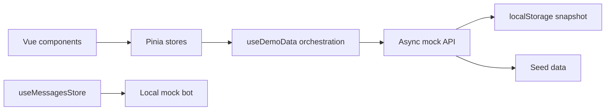

# Message Hub — Frontend Portfolio Case Study

## Паспорт проекта

| Параметр                  | Описание                                             |
| ------------------------- | ---------------------------------------------------- |
| Проект                    | Message Hub                                          |
| Формат                    | Frontend-only demo корпоративного мессенджера        |
| Роль                      | Frontend Developer                                   |
| Основной стек             | Nuxt 3, Vue 3, TypeScript, Pinia, SCSS, Tailwind CSS |
| Дополнительные библиотеки | Tiptap, Headless UI, vue-virtual-scroller, date-fns  |
| Хранение данных           | Версионированный snapshot в `localStorage`           |
| Интеграции                | Локальный mock API и детерминированный mock-бот      |
| Backend                   | Не требуется для запуска демо                        |
| Секреты и API-ключи       | Не требуются                                         |

## Краткое описание

Message Hub — интерактивное frontend-демо корпоративного мессенджера. Проект показывает не только набор Vue-компонентов, но и полноценную клиентскую архитектуру: нормализованную модель данных, разделение ответственности между Pinia stores, асинхронный mock API, локальное сохранение, обработку состояний запроса и переключение между несколькими пользователями.

Демо можно запустить локально без backend, WebSocket-сервера, внешнего AI API и секретных переменных. Пользователь сразу получает заполненное рабочее пространство с каналами, личными диалогами, приватной группой, историей сообщений и mock-ботом.

## Контекст и задача

Исходный проект создавался как frontend-часть корпоративного чата. Для portfolio-версии требовалось:

-   отделить демонстрационный интерфейс от отсутствующего backend;
-   убрать небезопасную прямую интеграцию с внешним AI API;
-   привести разрозненные данные к единой модели;
-   сделать приложение пригодным для демонстрации рекрутеру сразу после запуска;
-   сохранить реалистичные асинхронные сценарии без серверной инфраструктуры;
-   показать работу с состояниями loading, empty, error, retry и success;
-   создать несколько пользователей и разные представления одного чата.

## Моя зона ответственности

В рамках проекта выполнена frontend-архитектура и реализация пользовательских сценариев:

-   проектирование моделей `User`, `Conversation`, `Message`, `Attachment` и `Reaction`;
-   организация состояния в Pinia;
-   создание и композиция Vue-компонентов;
-   реализация асинхронного mock API;
-   сохранение и восстановление состояния из `localStorage`;
-   разработка direct-, channel- и group-chat сценариев;
-   реализация mock-бота;
-   работа с виртуализированным списком сообщений;
-   очистка небезопасного и неиспользуемого legacy-кода;
-   production build и ручная проверка ключевых клиентских сценариев.

Backend-часть, серверная авторизация, WebSocket-инфраструктура и реальная загрузка файлов не входят в scope этого frontend-демо.

## Пользовательские возможности

### Пользователи и сессия

-   10 переключаемых mock-сотрудников;
-   отдельный локальный Demo Bot;
-   имя, аватар или инициалы;
-   статус `online`, `away` или `offline`;
-   должность и краткое описание профиля;
-   переключатель **View demo as** в sidebar;
-   сохранение выбранного пользователя после перезагрузки.

При смене пользователя автоматически пересчитываются:

-   доступные каналы, приватные группы и direct-чаты;
-   активный разговор;
-   персональные unread-счётчики;
-   входящее или исходящее положение сообщений;
-   права на редактирование и удаление;
-   автор новых сообщений;
-   реакции от имени текущего пользователя;
-   персональный direct-чат с Demo Bot.

### Структура демо

В seed-данных подготовлены:

-   канал **General**;
-   канал **Frontend Team** с ограниченным составом участников;
-   канал **Product Updates**;
-   канал **Random**;
-   приватная группа **Launch Crew**;
-   набор личных диалогов между сотрудниками;
-   отдельный чат с Demo Bot для каждого сотрудника;
-   заполненная история сообщений, reactions и пример attachment.

### Сообщения

-   отправка текстовых сообщений;
-   отправка сообщения только с attachment;
-   редактирование собственных сообщений;
-   удаление собственных сообщений с анимацией;
-   отметка отредактированного сообщения;
-   emoji picker;
-   добавление и снятие reactions;
-   локальные file previews;
-   date separators;
-   виртуализированная отрисовка истории;
-   автоматический скролл к новому сообщению;
-   индикатор отправки;
-   лимит текста в 2000 символов и корректный перенос длинных строк;
-   контекстные действия edit/delete только у собственных сообщений;
-   empty state для разговора без сообщений и отдельное приглашение выбрать чат.

### Mock-бот

Demo Bot работает полностью локально:

-   не отправляет текст во внешние сервисы;
-   выбирает ответ по ключевым словам;
-   использует детерминированный fallback;
-   отвечает с небольшой искусственной задержкой;
-   показывает состояние **Demo Bot is typing**;
-   имеет отдельный разговор для каждого demo-пользователя.

### Demo API и сохранение

-   начальные данные загружаются из seed;
-   запросы выполняются асинхронно;
-   задержка mock API составляет 200–500 мс;
-   изменения автоматически сохраняются с debounce;
-   snapshot хранится под ключом `message-hub-demo-data-v3`;
-   кнопка **Reset demo data** возвращает исходное состояние;
-   временные `blob:` URL вложений не записываются в постоянное хранилище;
-   повреждённый или несовместимый snapshot заменяется актуальным seed.

### Состояния интерфейса

-   стартовый skeleton для sidebar и message panel;
-   контекстные empty states для сообщений, каналов, direct-чатов, пользователей и результатов поиска;
-   saving и saved-индикаторы;
-   индикатор отправки сообщения;
-   auto-dismiss toast-уведомления для успешных и информационных операций;
-   error message;
-   Retry для неудавшейся операции;
-   success после загрузки или reset;
-   dev-only переключатель **Simulate API errors**.

### UX-полировка

-   sidebar показывает последнее сообщение и относительное время;
-   unread текущего пользователя сбрасывается при открытии или восстановлении активного чата;
-   виртуализированный список повторно синхронизирует автоскролл после layout;
-   emoji picker и quick-reaction picker закрываются по клику снаружи;
-   удаление требует подтверждения;
-   отредактированные сообщения получают метку **edited**;
-   mock-бот показывает typing indicator;
-   вложения ограничены форматами PNG, JPG, PDF, DOCX и PPTX и размером 10 МБ на файл.

## Архитектура



Компоненты не изменяют props и seed-массивы напрямую. Все runtime-изменения проходят через действия Pinia stores. Seed используется только как исходное состояние mock API.

### Разделение Pinia stores

| Store                   | Ответственность                                                                     |
| ----------------------- | ----------------------------------------------------------------------------------- |
| `useSessionStore`       | ID текущего demo-пользователя                                                       |
| `useUsersStore`         | Профили, должности, описания и presence                                             |
| `useConversationsStore` | Membership, каналы, группы, direct-чаты, активный разговор и unread                 |
| `useMessagesStore`      | История, sending state, отправка, редактирование, удаление, reactions и typing бота |
| `useUiStore`            | Поиск, модальные окна, request state, sidebar state и notifications                 |

### Модель данных

```ts
interface User {
    id: string;
    name: string;
    avatarUrl?: string;
    status: 'online' | 'offline' | 'away';
    role: string;
    bio: string;
}

interface Conversation {
    id: string;
    type: 'direct' | 'group';
    groupKind?: 'channel' | 'private';
    name?: string;
    participantIds: string[];
    unreadCountByUserId: Record<string, number>;
    lastMessageId?: string;
}

interface Message {
    id: string;
    conversationId: string;
    authorId: string;
    text: string;
    createdAt: string;
    editedAt?: string;
    attachments: Attachment[];
    reactions: Reaction[];
}
```

Связи хранятся через ID, поэтому один пользователь или одно сообщение не дублируются в нескольких компонентах.

## Ключевые технические решения

### 1. Один источник истины

Seed-массивы не используются компонентами как изменяемое состояние. После загрузки snapshot данные находятся в Pinia, а UI только читает getters и вызывает actions.

### 2. Frontend-only API boundary

Компоненты не знают, используется ли настоящий сервер или `localStorage`. Асинхронный service layer имитирует сетевую границу и позволяет демонстрировать request states без backend.

### 3. Персональный unread

Один `unreadCount` недостаточен при переключении пользователей. Поэтому разговор хранит `unreadCountByUserId`. При отправке счётчик увеличивается для остальных участников, а при открытии сбрасывается только у текущего пользователя.

### 4. Безопасная portfolio-версия

Прямая отправка сообщений в OpenAI удалена. Текущий portfolio snapshot не содержит API-ключей, а AI-функция заменена локальным детерминированным ботом. Приложение не требует `.env`. Для публичной публикации используется чистая история репозитория без legacy-коммитов исходного проекта.

### 5. Версионирование snapshot

Изменение схемы данных не должно ломать уже открывавшееся демо. Snapshot содержит версию, а новый формат использует отдельный storage key. Некорректные данные автоматически заменяются seed.

### 6. Виртуализированная история

Для длинных списков используется `vue-virtual-scroller`. После полной замены snapshot список получает новую revision и перемонтируется, чтобы не сохранять устаревшие DOM-элементы после Reset.

### 7. Защита Save и Reset от гонок

Сохранение выполняется с debounce и сериализуется. Reset ожидает активную запись, блокирует новые сохранения на время операции и только затем применяет чистый snapshot.

## Структура проекта

```text
components/
  demo/           demo controls and request status
  messagePanel/   message history, editor, actions, typing
  modals/         delete confirmation, group members and new direct conversation
  sidebar/        user switcher, channels, conversations, unified search
  ui/             reusable buttons, avatar, uploader, reactions
composables/
  useDemoData.ts  hydration, persistence, reset and retry
mocks/
  users.ts
  conversations.ts
  messages.ts
services/
  mockApiService.ts
  mockBotService.ts
stores/
  sessionStore.ts
  usersStore.ts
  conversationsStore.ts
  messagesStore.ts
  uiStore.ts
types/
  normalized domain entities
```

## Проверка результата

Подтверждены следующие сценарии:

-   production-сборка `npm run build`;
-   загрузка seed v2;
-   автоматическое сохранение сообщения;
-   восстановление данных после reload;
-   Reset и немедленное обновление виртуализированного списка;
-   принудительная mock-ошибка;
-   восстановление через Retry;
-   переключение между Elena и Olivia;
-   изменение набора доступных разговоров;
-   смена сообщения с outgoing на incoming;
-   создание сообщения от имени активного пользователя;
-   редактирование своего сообщения;
-   удаление своего сообщения только после confirmation;
-   добавление новой реакции и снятие собственной реакции;
-   attachment-only сообщение с локальным image preview;
-   отображение имени, типа и размера вложения;
-   создание канала и выбор участников;
-   добавление и удаление участников существующей группы;
-   начало нового direct conversation;
-   поиск пользователей, ролей, каналов, разговоров и текста сообщений;
-   переход к найденному сообщению и его временная подсветка;
-   появление и скрытие bot typing indicator;
-   детерминированный ответ бота;
-   отображение sending indicator;
-   автоматический скролл после фактического перерасчёта высоты виртуального списка;
-   last message и timestamp в sidebar;
-   toast после Reset;
-   открытие и закрытие emoji picker по внешнему клику;
-   отсутствие Vue errors в чистом runtime-прогоне.

## Результат

Проект превращён в автономное frontend-демо, которое можно показать без подготовки окружения backend. Оно демонстрирует:

-   проектирование клиентской архитектуры;
-   управление сложным связанным состоянием;
-   работу с асинхронными сценариями;
-   TypeScript-моделирование;
-   компонентный подход;
-   UX для loading, empty, error, retry и success;
-   безопасную замену внешней интеграции;
-   умение подготовить legacy-проект к публичной демонстрации.

## Короткий рассказ для собеседования

> Я подготовил frontend корпоративного мессенджера как автономный portfolio-проект. Нормализовал пользователей, разговоры и сообщения, разделил состояние на пять Pinia stores и добавил асинхронный mock API с versioned persistence в localStorage. В демо можно переключаться между десятью сотрудниками, управлять составом групп, искать людей, каналы и сообщения, а также проходить полный CRUD-сценарий сообщения с reactions и локальными attachments. Для реалистичного UX добавил skeleton, sending и typing states, toast-уведомления, автоскролл виртуализированной истории, empty states и last-message previews. Я заменил небезопасную прямую AI-интеграцию локальным детерминированным ботом. В результате приложение запускается без backend и API-ключей, но сохраняет реалистичные frontend-сценарии.

## Честные границы проекта

Чтобы описание оставалось проверяемым, проект не следует представлять как:

-   production backend;
-   WebSocket-мессенджер реального времени;
-   систему с серверной авторизацией;
-   реальное файловое хранилище;
-   интеграцию с настоящим AI API;
-   проект с настроенным CI/CD, пока pipeline не добавлен.

Корректная формулировка: **frontend-only messenger demo with an asynchronous mock API and local persistence**.

Файлы не загружаются на сервер: для изображений создаётся локальный preview, а для документов сохраняются только имя, тип и размер.

## Этап 7: адаптивность и доступность

Интерфейс адаптирован под desktop, tablet и mobile. На desktop список разговоров и активный чат отображаются рядом. На tablet sidebar превращается в выезжающую панель с затемнением и блокировкой фонового контента. На mobile реализован последовательный сценарий «список разговоров → чат» с возвратом к списку из заголовка.

Для доступности выполнены следующие изменения:

-   каналы и личные диалоги реализованы семантическими `button`;
-   icon buttons получили понятные `aria-label`;
-   активный разговор обозначается через `aria-current`;
-   drawer синхронизирует `aria-expanded`, `aria-hidden` и `inert`;
-   после открытия или закрытия мобильной панели фокус переносится в актуальную область;
-   Escape закрывает tablet/mobile sidebar;
-   интерактивные элементы имеют заметный `:focus-visible`;
-   повышен контраст вторичного текста;
-   анимации и плавный скролл отключаются при `prefers-reduced-motion: reduce`;
-   модальные окна, редактор, сообщения и вложения адаптированы к узким экранам.

Результат проверен вручную на viewport 1366×800, 900×760 и 390×844. На всех размерах документа, sidebar и message panel отсутствует горизонтальное переполнение. Production-сборка `npm run build` проходит успешно.

## Этап 8: качество кода

Для проекта настроен единый frontend quality gate:

-   ESLint 9 с Nuxt flat config;
-   Prettier и отдельная проверка форматирования;
-   strict TypeScript и `noUncheckedIndexedAccess`;
-   отдельная команда `npm run typecheck`;
-   15 unit-тестов Pinia stores и mock services;
-   4 component-теста критичных интерактивных элементов;
-   7 Playwright E2E-сценариев в Chromium;
-   production build как финальная часть `npm run quality`.

E2E покрывают открытие direct-чата и отправку сообщения, создание канала, переключение
mock-пользователя, сохранение после reload и восстановление seed через **Reset demo data**.
Подробное описание находится в [QUALITY_STAGE_8_RU.md](./QUALITY_STAGE_8_RU.md).
